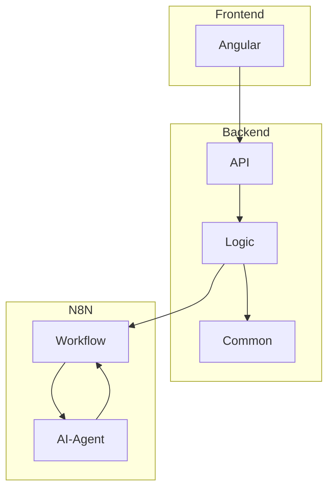

<!-- _class: lead -->
<!-- _paginate: false -->

# Moderne Softwareentwicklung mit AI, n8n und AI-Agenten

**Für erfahrene Lehrkräfte mit Software-Entwicklungskompetenzen**

---

## Agenda

1. Softwareentwicklung mit AI
2. AI-Agenten erstellen mit n8n
3. Verknüpfung: Traditionelle Entwicklung + n8n
4. Praxistipps & Ressourcen
5. Q&A

**Dauer:** 60-75 Minuten

---



---

<!-- _class: lead -->

# Teil 1: Softwareentwicklung mit AI

---

## Der Paradigmenwechsel

### Früher → Heute

- **Stack Overflow** → **AI-Copilot**
- **Manuelle Dokumentation** → **AI erklärt Code**
- **Copy & Paste** → **Kontextbewusste Generierung**
- **Stundenlang debuggen** → **AI findet Bugs in Sekunden**

> **💡 AI ersetzt nicht – AI assistiert!**

---

## Konkrete Tools im Überblick

| Tool | Einsatzbereich | Stärke |
|------|----------------|--------|
| **GitHub Copilot** | Code-Vervollständigung | Kontext in IDE |
| **ChatGPT/Claude** | Vollständige Lösungen | Erklärungen |
| **Cursor** | AI-native IDE | Projekt-Kontext |
| **Phind** | Code-Suche | Developer-fokussiert |
| **Windsurf** | AI-native IDE | Multi-Agent-System |

**Alle Tools ergänzen sich!**

---

## Live-Demo 1: Code-Generierung

**Aufgabe:** Python-Funktion für Notenberechnung

### Traditionell:
- pandas-Dokumentation lesen (15 Min)
- Syntax recherchieren (10 Min)
- Code schreiben (20 Min)
- Testen & Debuggen (15 Min)

**≈ 60 Minuten**

### Mit AI:
- Prompt schreiben (2 Min)
- Code generieren (30 Sek)
- Verstehen & anpassen (5 Min)
- Testen (2 Min)

**≈ 10 Minuten**

**Zeitersparnis: ~83%**

---

## Der Prompt macht den Unterschied

### ❌ Schlechter Prompt:
```
Schreib mir Code für Noten
```

### ✅ Guter Prompt:
```
Erstelle eine Python-Funktion mit pandas, die:
- CSV-Datei mit Spalten 'Name', 'Mathe', 'Deutsch', 'Englisch' einliest
- Durchschnitt berechnet
- Nach Durchschnitt sortiert
- Error Handling für fehlende Dateien implementiert
- Type Hints verwendet
- Docstring nach PEP 257 enthält
```

**Spezifität = Qualität**

---

## Anwendungsfälle für Lehrkräfte

### 🎯 Schnelles Prototyping
Idee → funktionierender Prototyp in Minuten

### 📊 Bewertungstools
Automatische Code- und Textanalyse

### 🌐 Lernplattformen
Interaktive Web-Apps ohne große Teams

### 🐛 Code-Review & Debugging
AI als zweites Augenpaar

### 📝 Unterrichtsmaterialien
Automatische Generierung von Übungen und Tests

---

## Live-Demo 2: Code-Refactoring

**Vorher:** Verschachtelter, unlesbarer Code

```python
def calc(d):
    r=0
    for i in d:
        if i>0:
            if i<100:
                r+=i*1.5
            else:
                r+=i*2
    return r
```

**Mit AI:** "Refactore diesen Code: Lesbarkeit, Docstrings, Type Hints"

---

## Nach AI-Refactoring

```python
def calculate_weighted_sum(values: list[float]) -> float:
    """
    Berechnet gewichtete Summe basierend auf Wertebereichen.
    
    Args:
        values: Liste numerischer Werte
        
    Returns:
        Gewichtete Summe aller positiven Werte
    """
    total = 0.0
    for value in values:
        if value <= 0:
            continue
        weight = 1.5 if value < 100 else 2.0
        total += value * weight
    return total
```

**+ Erklärung warum!**

---

## Best Practices für AI-Entwicklung

### ✅ Wann AI nutzen?
- Boilerplate-Code
- Standardalgorithmen
- Tests & Mock-Daten
- Dokumentation
- Erste Prototypen

### ⚠️ Wann selbst coden?
- Kritische Geschäftslogik
- Security-relevanter Code
- Performance-kritisch
- Innovatives ohne Beispiele
- Lernzwecke!

---

## Qualitätssicherung ist Pflicht!

### Die 7-Punkte-Checkliste:

1. ✅ Code **verstanden**?
2. ✅ **Funktioniert** wie erwartet?
3. ✅ Keine **Security-Lücken**?
4. ✅ **Dependencies** vertrauenswürdig?
5. ✅ **Performance** akzeptabel?
6. ✅ **Error Handling** vorhanden?
7. ✅ **Tests** geschrieben?

**AI generiert Code – Sie verantworten ihn!**

---

## Grenzen & kritische Reflexion

### Technische Grenzen
- 🤔 **Halluzinationen**: Erfindet APIs oder Funktionen
- 📅 **Veraltetes Wissen**: Cutoff-Date beachten
- 🔄 **Inkonsistenzen**: Verschiedene Lösungen bei gleichen Prompts
- 🧠 **Kontext-Verlust**: Bei langen Chats oder großen Projekten
- 🎯 **Verständnis**: Kein echtes Verständnis, nur Mustererkennung

### Abhängigkeiten
- 💰 Kosten können steigen
- 🔒 Vendor Lock-in
- 🌐 Service-Verfügbarkeit
- ⚡ Latenz bei Cloud-APIs

**Lösung:** Hybrid-Ansatz + lokale Modelle als Backup

---

## DSGVO im Schulkontext

### ⚠️ KRITISCH:

**NIEMALS personenbezogene Daten ohne Absicherung in Cloud-AI!**
- ❌ Schülernamen
- ❌ Noten
- ❌ Gesundheitsdaten
- ❌ Kontaktdaten
- ❌ Fotos/Videos

### ✅ Lösungen:
- Anonymisierung/Pseudonymisierung vor AI-Nutzung
- Lokale LLMs (Ollama, LM Studio, LocalAI)
- Enterprise-Verträge mit DSGVO-Garantien (AVV)
- Self-Hosting auf eigenen Servern
- EU-basierte AI-Services (z.B. Aleph Alpha)

---

## Pädagogische Implikationen

### Welche Kompetenzen bleiben essentiell?

1. **Algorithmisches Denken**
2. **Debugging & Problemlösung**
3. **Systemdesign & Architektur**
4. **Code-Verständnis & -Qualität**
5. **Kritisches Hinterfragen**
6. **Security-Bewusstsein**

### Was ändert sich?
- Weniger Syntax-Fokus
- Mehr Konzepte & Design Patterns
- **Neue Kompetenz:** Prompt Engineering
- Schnelleres Prototyping
- Stärkere Fokussierung auf Testing
- Wichtigkeit von Code-Review steigt

---

<!-- _class: lead -->

# Teil 2: AI-Agenten mit n8n

---

## Was ist n8n?

**n8n = "nodemation"**

> Open-Source Workflow-Automatisierung
> Visuelles Programmieren
> AI-Integration ohne Code

### Der "Lego-Baukasten" für Automatisierung

**Nodes** = Bausteine  
**Connections** = Verbindungen  
**Workflows** = Fertige Lösungen

---

## n8n vs. Alternativen

| Feature | n8n | Zapier | Make | Power Automate |
|---------|-----|--------|------|----------------|
| **Open Source** | ✅ | ❌ | ❌ | ❌ |
| **Self-Hosting** | ✅ | ❌ | ❌ | ⚠️ |
| **Kosten (self-hosted)** | 0€ | ab 30€ | ab 10€ | ab 15€ |
| **DSGVO-Kontrolle** | ✅ | ❌ | ❌ | ⚠️ |
| **Code-Integration** | ✅ | ❌ | ⚠️ | ⚠️ |
| **AI-Features** | ✅✅ | ⚠️ | ⚠️ | ⚠️ |
| **Lernkurve** | Mittel | Niedrig | Mittel | Mittel |

**n8n = Beste Wahl für Schulen!**

---

## Warum n8n für Schulen?

### 🔐 DSGVO-konform
Self-Hosting auf eigenen Servern

### 💰 Kosteneffizient
Keine laufenden Gebühren

### 🔍 Transparent
Open Source, kein Vendor Lock-in

### 📚 Lernpotential
Schüler können Workflows erstellen

### 🚀 Flexibel
Von einfach bis hochkomplex

---

## n8n Grundkonzepte

### Node-Kategorien

**1. Trigger** - Starten Workflows
- Schedule (Cron)
- Webhook (HTTP)
- Email/File Events

**2. Services** - Externe Dienste
- Google (Drive, Sheets, Gmail)
- Slack, Teams
- Datenbanken

**3. Logic** - Steuerung
- IF, Switch, Loop
- Merge, Split

**4. AI** - KI-Integration
- OpenAI, Claude
- Langchain

---

## Datenfluss verstehen

```
Trigger (neue Email)
  ↓
{
  "from": "schueler@example.com",
  "subject": "Frage zu Hausaufgabe",
  "body": "Wie funktioniert..."
}
  ↓
Nächster Node kann zugreifen:
{{ $json.from }}
{{ $json.subject }}
```

**Jeder Node gibt JSON-Daten weiter**

---

## AI-Integration in n8n

### Verfügbare AI-Dienste:

**Cloud-basiert:**
- OpenAI (GPT-4o, GPT-3.5)
- Anthropic Claude
- Google Gemini

**Lokal (DSGVO-konform):**
- Ollama
- LM Studio
- Local AI

**Framework:**
- Langchain (Advanced Agents)

---

## Live-Demo: Erster AI-Workflow

### Einfacher Chatbot

```
[Manual Trigger]
  ↓
[Set: User-Eingabe]
  ↓
[OpenAI: Antwort generieren]
  ↓
[Display: Ergebnis anzeigen]
```

**In 5 Minuten erstellt!**

---

## Praxisbeispiel: Hausaufgaben-Feedback-Bot

### Das Problem:
- 30 Abgaben pro Woche
- Jede braucht 10-15 Min Review
- **= 5-7 Stunden Arbeit**

### Die Lösung:
Automatisches AI-Feedback in Minuten

**Zeitersparnis: ~80%**

⚠️ **Wichtig:** AI-Feedback ist Vorschlag, finale Bewertung bleibt bei der Lehrkraft!

---

## Workflow-Architektur

```
[1] Google Drive Trigger
    (Neue PDF-Datei)
      ↓
[2] Datei herunterladen
      ↓
[3] PDF → Text extrahieren
      ↓
[4] AI-Prompt konstruieren
      ↓
[5] OpenAI: Feedback generieren
      ↓
[6] Email formatieren
      ↓
[7] Gmail: An Schüler senden
      ↓
[8] Google Sheets: Protokollieren
```

---

## Der AI-Prompt (Beispiel)

```
Du bist ein erfahrener Lehrer. Analysiere die folgende Hausaufgabe und gib konstruktives Feedback.

Bewerte nach folgenden Kriterien:

1. Inhaltliche Richtigkeit (0-10 Punkte)
2. Struktur und Aufbau (0-10 Punkte)
3. Sprache und Ausdruck (0-10 Punkte)
4. Vollständigkeit (0-10 Punkte)

Gib strukturiertes Feedback:
- Zusammenfassung (2-3 Sätze)
- Stärken (3 konkrete Punkte)
- Verbesserungspotenzial (3 konkrete Punkte)
- Bewertung je Kriterium mit Begründung
- Vorschlag für Gesamtnote (1-6) mit Begründung
- Konkrete Tipps für die Überarbeitung

Ton: Konstruktiv, motivierend, auf Augenhöhe

Hausaufgabe:
[Text hier]
```

---

## Live-Demo: Workflow in Aktion

### Schritt 1: PDF hochladen
Schüler lädt Hausaufgabe hoch

### Schritt 2: Automatische Verarbeitung
n8n erkennt neue Datei → Workflow startet

### Schritt 3: AI-Analyse
GPT-4 analysiert Inhalt

### Schritt 4: Feedback-Versand
Email an Schüler + Log in Spreadsheet

**Von Upload bis Feedback: < 2 Minuten**

---

## Weitere Beispiel-Agenten

### 📊 Wöchentlicher Report-Generator
Automatische Leistungsübersicht jeden Sonntag

### 💬 FAQ-Chatbot
24/7 Antworten auf Fragen zum Unterrichtsstoff

### 📝 Übungsgenerator
Individualisierte Arbeitsblätter auf Knopfdruck

### 👨‍💻 Code-Review-Bot
Automatisches Feedback zu Programmieraufgaben

### 📧 Email-Assistent
Automatische Sortierung und Beantwortung wiederkehrender Anfragen

---

## Advanced: RAG-System

### RAG = Retrieval Augmented Generation

**Problem:** AI kennt eure Unterrichtsmaterialien nicht

**Lösung:** 
1. Dokumente in Vector-DB speichern
2. Bei Frage: Relevante Passagen finden
3. AI bekommt Kontext + Frage
4. Antwort basiert auf euren Materialien

**= AI mit eurem Wissen!**

---

## RAG-Workflow vereinfacht

```
[Einmalig: Setup]
PDFs → Text → Chunks → Embeddings → Vector DB

[Bei Anfrage:]
Frage → Embedding → Similarity Search 
  → Top 5 Chunks → AI + Kontext → Antwort
```

**Vorteil:** DSGVO-konform + fachlich korrekt

---

<!-- _class: lead -->

# Teil 3: Hybrid-Architekturen

---

## Die zentrale Frage

# Wann n8n?
# Wann traditioneller Code?

---

## Entscheidungsmatrix

### ✅ n8n ist ideal für:
- Orchestrierung zwischen Services
- Wiederkehrende Automatisierungen
- API-Integration ohne Code
- Schnelles Prototyping
- Häufig ändernde Business Logic

### ✅ Traditioneller Code ist besser für:
- Performance-kritische Operationen
- Komplexe Algorithmen
- User Interfaces
- Umfangreiche Datenmodellierung
- Team-Entwicklung mit Git

---

## Best-of-Both-Worlds Architektur

```
┌──────────────────────┐
│   React Frontend     │
│  (Traditionell)      │
└──────────┬───────────┘
           │ REST API
┌──────────▼───────────┐
│   n8n Workflows      │
│  (Orchestrierung)    │
└┬────────┬─────────┬──┘
 │        │         │
 ▼        ▼         ▼
API    OpenAI    Email
 │
 ▼
Python Backend
Database
```

---

## Beispiel: Schülerverwaltung

| Komponente | Technologie | Warum? |
|------------|-------------|---------|
| Login/Auth | FastAPI | Security-kritisch |
| Schüler-CRUD | FastAPI | Komplexe Validierung |
| Noteneingabe | FastAPI | Transaktionen |
| Zeugnisse PDF | n8n → Python | Standardisiert |
| Eltern-Emails | n8n | Automatisierung |
| AI-Empfehlungen | n8n → OpenAI | Einfache Integration |
| Reports | Python → n8n | Berechnung + Versand |

---

## Integration: Python → n8n

### Methode 1: Webhook Trigger

```python
import requests

def trigger_workflow(student_id, event):
    webhook_url = "http://n8n:5678/webhook/student-event"
    
    payload = {
        'student_id': student_id,
        'event': event,
        'timestamp': datetime.now().isoformat()
    }
    
    response = requests.post(webhook_url, json=payload)
    return response.json()

# Verwendung
trigger_workflow(12345, 'grade_updated')
```

---

## Integration: n8n → Python API

### In n8n: HTTP Request Node

```
POST http://backend-api:8000/calculate-statistics

Body:
{
  "class_id": {{ $json.class_id }},
  "grades": {{ $json.grades }}
}

Response:
{
  "average": 2.8,
  "median": 3.0,
  "distribution": {...}
}
```

**n8n ruft Python-Funktion → Nutzt Ergebnis**

---

## Code-Nodes in n8n

### Wann Code-Nodes verwenden?

**✅ Gut für:**
- Datenmanipulation
- Berechnungen
- String-Operationen
- Kleine Helfer-Funktionen

**❌ Nicht geeignet für:**
- Lange Operationen (Timeout!)
- Große Datenmengen (Memory!)
- Externe Dependencies
- Komplexe Business-Logic

---

## JavaScript Code-Node Beispiel

```javascript
// Notenberechnung mit Gewichtung
const items = $input.all();

const results = items.map(item => {
  const grades = item.json.grades;
  
  // Klausuren zählen doppelt
  const weighted = grades.map(g => ({
    grade: g.grade,
    weight: g.type === 'exam' ? 2 : 1
  }));
  
  const totalWeight = weighted.reduce((sum, g) => 
    sum + g.weight, 0);
  const weightedSum = weighted.reduce((sum, g) => 
    sum + (g.grade * g.weight), 0);
  
  const final = weightedSum / totalWeight;
  
  return {
    json: {
      student_id: item.json.student_id,
      final_grade: Math.round(final * 100) / 100,
      passed: final <= 4.0
    }
  };
});

return results;
```

---

## Docker-Setup für Hybrid-System

```yaml
services:
  frontend:
    image: react-app
    ports: ["3000:3000"]
  
  backend:
    image: fastapi-app
    ports: ["8000:8000"]
    environment:
      - N8N_WEBHOOK_URL=http://n8n:5678
  
  n8n:
    image: n8nio/n8n
    ports: ["5678:5678"]
    volumes:
      - n8n_data:/home/node/.n8n
  
  database:
    image: postgres:15
    volumes:
      - db_data:/var/lib/postgresql/data

volumes:
  n8n_data:
  db_data:

# Alle Services im gleichen Netzwerk
# → Können sich gegenseitig erreichen
```

---

## Best Practices

### Versionierung von Workflows

**Problem:** n8n-Workflows sind JSON, nicht Code

**Lösung:**
1. Workflows exportieren (JSON)
2. In Git committen
3. CI/CD für Deployment

```bash
# Export
curl -u admin:pass \
  http://n8n/api/v1/workflows/123/export \
  > workflow.json

git add workflow.json
git commit -m "Update feedback workflow"
```

---

## Testing-Strategien

### 1. Manual Testing
- Jeden Node einzeln ausführen
- "Execute Node" Button
- Beispieldaten manuell

### 2. Automated Testing
- Python-Scripts für Webhooks
- Assert auf Response
- CI/CD Integration

### 3. Integration Tests
- Gesamte Kette testen
- Frontend → n8n → Backend

---

## Monitoring & Logging

### In n8n:
- Execution History
- Error-Trigger-Nodes
- Logging-Nodes

### Best Practice:
```
[Jeder kritische Node]
  ↓
[Bei Fehler: Error Handler]
  ↓
[Log to Database]
  ↓
[Send Admin Alert (Slack/Email)]
```

**Nie blind vertrauen – immer überwachen!**

---

<!-- _class: lead -->

# Teil 4: Praxistipps

---

## Einstieg: Cloud vs. Self-Hosting

### Cloud (n8n.cloud)
**Vorteile:**
- ⚡ Sofort starten
- 🔄 Auto-Updates
- 👍 Keine Wartung

**Nachteile:**
- 💰 €20-100/Monat
- 🌐 Daten extern
- ⚠️ DSGVO prüfen!

### Self-Hosting (empfohlen)
**Vorteile:**
- 🔐 Volle Kontrolle
- ✅ DSGVO-sicher
- 💰 Nur Server-Kosten

**Nachteile:**
- 🛠️ Setup nötig
- 🔧 Wartung selbst

---

## Quick Start Self-Hosting

```bash
# Mit Docker (einfachste Methode)
# ACHTUNG: Nur für Tests! Produktiv mit docker-compose!
docker run -it --rm \
  --name n8n \
  -p 5678:5678 \
  -v ~/.n8n:/home/node/.n8n \
  n8nio/n8n

# Dann: http://localhost:5678 öffnen
# Bei erstem Start: Admin-Account erstellen!
```

**In 5 Minuten läuft n8n!**

---

## Produktions-Setup für Schulen

### Empfehlung:
1. **Server mieten**
   - Hetzner Cloud: €5-15/Monat (je nach Leistung)
   - In Deutschland gehostet (DSGVO-konform)
   - Alternativ: Netcup, Contabo

2. **Domain + SSL**
   - n8n.eure-schule.de
   - Let's Encrypt (kostenlos)

3. **Docker Compose**
   - n8n + PostgreSQL
   - Automatische Backups

4. **Zugriffskontrolle**
   - Starke Passwörter
   - 2FA aktivieren

---

## DSGVO-Checkliste

### Technisch:
- [ ] Server in EU
- [ ] SSL-Verschlüsselung
- [ ] Zugriffskontrolle
- [ ] Regelmäßige Backups
- [ ] Logging aktiviert

### Organisatorisch:
- [ ] Datenschutzbeauftragten informiert
- [ ] Verarbeitungsverzeichnis aktualisiert
- [ ] Einwilligungen eingeholt (falls nötig)
- [ ] Incident-Response-Plan

### Bei AI-Nutzung:
- [ ] Keine Personendaten in Cloud-AI ohne Absicherung
- [ ] Oder: AVV (Auftragsverarbeitungsvertrag) mit Anbieter
- [ ] Lokale Modelle für sensible Daten
- [ ] Transparenz gegenüber Schülern/Eltern
- [ ] Datenminimierung beachten
- [ ] Transparenz gegenüber Schülern/Eltern
- [ ] Datenminimierung beachten

---

## Lokale vs. Cloud AI

### Cloud AI (OpenAI, Claude)
**Pro:**
- ✅ Beste Qualität
- ✅ Schnell & einfach

**Contra:**
- ❌ Daten extern
- ❌ Kosten pro Token
- ❌ Internet nötig

### Lokale AI (Ollama, LM Studio)
**Pro:**
- ✅ Volle Kontrolle
- ✅ DSGVO-sicher
- ✅ Keine API-Kosten

**Contra:**
- ❌ Geringere Qualität
- ❌ Eigene Hardware
- ❌ Setup-Aufwand

**Empfehlung: Hybrid!**

---

## Unterrichtsintegration

### Jahrgangsstufe 9-10
- Einführung Automatisierung
- Einfache Workflows (ohne Code)
- APIs verstehen

### Jahrgangsstufe 11-12
- AI-Integration
- Prompt Engineering
- Hybrid-Systeme
- Ethik-Diskussionen

### Leistungskurs
- Komplexe Agenten
- RAG-Systeme
- Full-Stack-Projekte

---

## Projekt-Ideen für Schüler

### Anfänger:
- Automatischer Notiz-Organizer
- Geburtstags-Reminder
- News-Digest

### Fortgeschritten:
- Lern-Assistent mit Quiz-Generator
- Code-Review-Bot
- Podcast-Zusammenfassung

### Experten:
- Multi-Agenten-System
- RAG-basierter Wissens-Bot
- Vollständige Web-App

---

## Balance: Low-Code vs. Coding

### Diskussion mit Schülern:
> "Wenn n8n so einfach ist, warum noch 
> 'richtig' programmieren lernen?"

### Antwort:
- Algorithmisches Denken bleibt essentiell
- Debugging braucht Code-Verständnis
- Komplexe Logik oft in Code effizienter
- Die meisten Jobs brauchen beides

### Empfohlene Balance:
**60% Code | 30% Low-Code/AI-Tools | 10% Theorie**

---

## Ressourcen

### n8n:
- 📚 Dokumentation: https://docs.n8n.io
- 🎬 YouTube: @n8n_io
- 💬 Community: https://community.n8n.io
- 🔧 GitHub: https://github.com/n8n-io/n8n
- 🎓 n8n Academy: https://n8n.io/academy

### AI & Prompt Engineering:
- 📖 Learn Prompting: https://learnprompting.org
- 🎓 OpenAI Cookbook: https://cookbook.openai.com
- 🧠 LangChain: https://python.langchain.com
- 📚 Anthropic Prompt Library: https://docs.anthropic.com/claude/prompt-library

### Community:
- Discord-Server (Link folgt)
- GitHub-Repo mit Beispielen
- Monatliche Meetups

---

<!-- _class: lead -->

# Zusammenfassung

---

## Die 5 Key Takeaways

### 1. AI verändert, ersetzt nicht
Entwickler bleiben wichtig – Skills verschieben sich

### 2. n8n demokratisiert AI
Schneller Zugang ohne tiefe API-Kenntnisse

### 3. Hybrid ist die Zukunft
Code + Low-Code = Beste Ergebnisse

### 4. Datenschutz ist essentiell
DSGVO von Anfang an mitdenken

### 5. Praktisch lernen
Theorie + Hands-on = Erfolg

---

## Zukunftsperspektiven

### Kurzfristig (1-2 Jahre):
- AI-Copiloten werden Standard in allen IDEs
- Low-Code/No-Code wird mainstream
- Multimodale AI (Text, Bild, Audio, Video) überall
- AI-Agents als Team-Mitglieder

### Mittelfristig (3-5 Jahre):
- Autonome Multi-Agent-Systeme
- AI-Kompetenz fest im Lehrplan verankert
- Klarere DSGVO-Richtlinien für AI
- Lokale AI-Modelle auf Consumer-Hardware

### Langfristig (5+ Jahre):
- AI als vollwertiger Co-Teacher
- Vollautomatisierte Workflows
- Quantensprünge in AI-Fähigkeiten
- Neue Programmierparadigmen

---

## Was das für Sie bedeutet

### Als Lehrkraft:
- 📚 Lebenslanges Lernen
- 🎯 Fokus auf Kompetenzen statt Syntax
- 🛠️ Neue Tools ausprobieren
- ⚖️ Ethische Verantwortung

### Im Unterricht:
- Kritisches Denken wichtiger denn je
- Projektbasiertes Lernen einfacher
- Balance zwischen Tools und Grundlagen
- Schüler auf AI-Welt vorbereiten

---

## Nächste Schritte

### Heute:
1. ✅ n8n ausprobieren (Docker!)
2. ✅ Ersten Workflow erstellen
3. ✅ Mit AI experimentieren

### Diese Woche:
1. 📂 Materialien durcharbeiten
2. 🔧 Use Case für Ihre Schule finden
3. 🧪 Ersten Prototyp bauen

### Langfristig:
1. 👥 Community beitreten
2. 🎓 Follow-up-Workshop
3. 🚀 Projekte umsetzen

---

## Ihre Ansprechpartner

### Kontakt:
📧 **Email:** [Ihre Email]
💬 **Discord:** [Link zum Server]
🔗 **GitHub:** [Repository-Link]
📅 **Follow-up:** [Termin]

### Materialien:
- 📊 Präsentation (PDF)
- 🔄 n8n-Workflows (JSON)
- 💻 Code-Beispiele
- 📚 Ressourcen-Liste
- ✅ DSGVO-Checkliste

**Alles verfügbar unter:** [Link]

---

<!-- _class: lead -->

# Fragen & Diskussion

## Ihre Fragen?

### Themen:
- 🔧 Technische Fragen
- 💡 Konzeptionelles
- 🏫 Unterrichtsintegration
- ⚖️ Datenschutz & Recht

**Kein Thema zu klein oder zu groß!**

---

# Vielen Dank!

## Bleiben wir in Kontakt

**Community-Austausch:**
- Monatliche Online-Meetups
- Show & Tell Ihre Projekte
- Gemeinsam lernen

**Feedback willkommen:**
[QR-Code zum Feedback-Formular]

---

<!-- _class: lead -->
<!-- _paginate: false -->

# Vielen Dank!

**Viel Erfolg mit AI & n8n! 🚀**

**Bleiben Sie in Kontakt!**